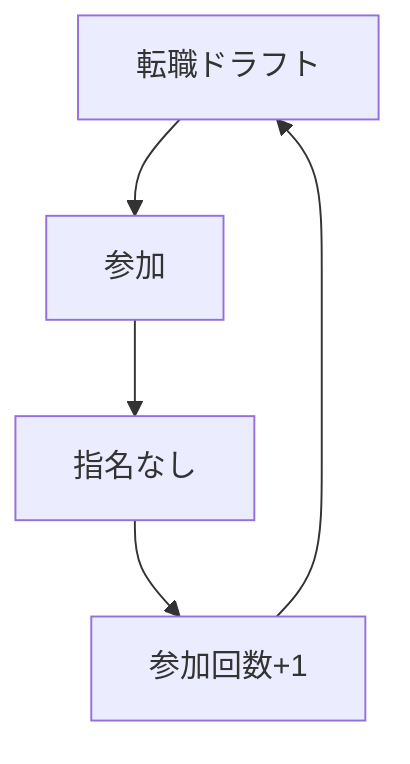

- 東京からIターンで島根県西部にきたエンジニアです。
- 所轄SIerというものなので、スキルが低いことに気づいて勉強用にチマチマとやっていく。->急に自社開発になって四苦八苦して5年が経過。
- エンジニアを名乗っていいのか？という疑問が沸き立つが、震える両足を抑えながらがんばる。
- IPAが基本情報技術者試験突破すれば技術者と言ってた気がするので、エンジニアと名乗ることにする（震える）
- 業務でつかってるgitアカウントではないのでスカスカな感じです。

--- 
- メインの言語は「Java」ですが最近「JavaScript」って便利じゃねって思って練習中。varをいまだに使ってしまう程度にキャッチアップができてなく。アップデート中
- varはつかわなくなりconstを多用するようになってきた気がする。（再代入不可のconstだけで事足りないかとか思いつつあるレベル）
- for内ではletも便利か？程度のレベルです。
- teratailでは「JasperReports」タグで１位だったりします。このタグだけ頑張って質問に答えようとしています。

---- 

- ガンダムで好きなMSはガルスJです。
- ジオンのモビルスーツすき。モノアイが特に良い。

----

# Githubでの活動内容

****

----
## 転職ドラフトに参加した結果！！！

<!---
ababaSigrun/ababaSigrun is a ✨ special ✨ repository because its `README.md` (this file) appears on your GitHub profile.
You can click the Preview link to take a look at your changes.
--->
---

やること
- node.js -> https://gihyo.jp/dev/serial/01/nodejs
- kotlin(Android)
---
やること（優先度低）
- Vue.js -> 昔作ったチュートリアルをいい加減完成させること。
- TypeScript -> https://atmarkit.itmedia.co.jp/ait/subtop/features/dotnet/typescript_index.html -> 第一回読んだ。

---
読む本
- アジャイルサムライ（45p～
- Git実践入門
- リーダブルコード(15p～

